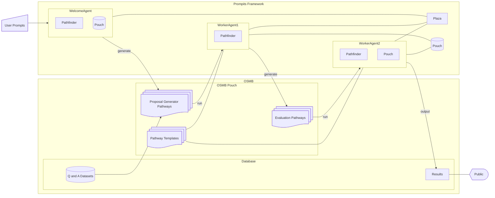

# OSMB on Prompits
> ⚠️ **Work in Progress**  
> OSMB on Prompits is currently under active development. Expect rapid changes, incomplete features, and ongoing experimentation. Contributions and feedback are welcome!

**OSMB (Open Source Model Benchmarker)** is being reimagined as a next-generation benchmarking platform built entirely on the **Prompits** framework.

This version of OSMB leverages Prompits' modular, decentralized, and multi-agent architecture to create a flexible, extensible, and community-driven environment for evaluating models using Q&A-style benchmarks.

OSMB will be a **Pathway-only application**, meaning all logic, benchmarking, and model execution flows are defined and run through Prompits' `Pathway` scripts. This ensures that OSMB remains modular, reproducible, and fully integrated into the Prompits architecture—leveraging only native Prompits components for execution.

## 🚀 Why OSMB on Prompits?

Prompits introduces powerful building blocks for orchestrating intelligent agents, managing workflows, and integrating community-driven scoring and governance. This new version of OSMB will benefit from:

- **Multi-agent coordination** via Prompits' `Pit`, `Pathway`, `Post`, and `Plug` primitives.
- **AI + Human evaluation** pipelines, with integrated feedback loops powered by the `Profiler` role.
- **Distributed resource management**, reward-driven incentives (`Pondo`), and DAO-based governance.
- **Evolutionary optimization**, where multiple pathways compete and evolve to identify optimal model testing flows.
- **AI-generated testsets for real-world problems**, enabling dynamic and continuously evolving benchmark challenges.
- **Prompits' evolutionary algorithm** drives the discovery of optimal models and pathways tailored to each unique problem context.
- **Integrated optimization engine**, where OSMB functions as a fitness evaluation layer for evolving Prompits components—models, workflows, and even agents.

## 🧱 Structure

All source code and components for OSMB live under `examples/osmb/`. The main components include:

- `benchmarks/` – Standardized Q&A datasets and evaluation sets.
- `agents/` – Prompits agents (Pits) for running models, scoring answers, and managing evaluation workflows.
- `pathways/` – Pathway definitions for running model benchmarks end-to-end.
- `results/` – Evaluation outputs and leaderboard data.

## 🧠 Model Evaluation Flow

1. A `Proposal` is submitted to evaluate a model on a specific dataset or task.
2. The `Pathfinder` selects and optimizes a `Pathway` based on performance history and Profiler rankings.
3. Agents (Pits) execute Posts within the Pathway:
    - Load Q&A data
    - Run model predictions
    - Compare outputs to ground truth
    - Score results using both AI metrics and optional human feedback
4. The `Profiler` scores and ranks performance, feeding data back to evolve better workflows.

## 📊 Visualization

Future versions will support integration with a web-based viewer (e.g. Streamlit or React) to explore benchmark results, leaderboards, and scoring histories.

## 🛠️ Setup

Coming soon. The OSMB implementation is actively under development.

## 📣 Community & Contributions

This is a community-first project! Contributions are welcome, especially in the areas of:

- New benchmark datasets
- New evaluation agents (Pits)
- Custom scoring Practices
- Frontend leaderboard interfaces

Follow development at [https://github.com/alvincho/prompits](https://github.com/alvincho/prompits) and [https://osmb.ai](https://osmb.ai).
## 🧭 Architecture Overview

---
Powered by Prompits – a new kind of open-source AI coordination engine.
